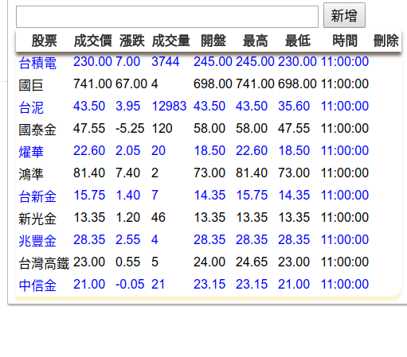

Chrome Extension Stock App
==========

A Chrome extension app that displays Taiwan (TWSE) stock quotes in real time.
Allowing you to monitor the Taiwan twse Stock Exchange with popup notifications.

The app periodically fetches real-time stock information and shows on right corner of Chrome browser

To manually install the Google Chrome extension:
-----------------------

* Download and Unzip the contents to a new folder
* Open Chrome, type: `chrome://extensions` in the web address bar or to find `Extensions` from `More tools` selection.
* Check the `Developer mode` checkbox
* Click the `Load unpacked extension...` button
* Navigate to the folder you unzipped & select it
* Click "Open"

Clone Repo
-----------------------
* git clone https://github.com/james062525/realtimestock.git

Libraries
-----------------------
* JQuery
* JQuery autocomplete

Reference
-----------------------
* [Taiwan Stock Exchange Corporation (TWSE)](http://www.tse.com.tw/)

NOTE:
-----------------------
* Use the source for educational study purpose only.
* Run '''python3 stocklist.py''' will create new '''stocklist.js''' file.

License
---------
[MIT](http://opensource.org/licenses/MIT)
